# Catalyst 8000v IPsec VTI + eBGP lab — with a VPN provisioning portal

A hub-and-spoke IPsec VPN built and operated **entirely as code**: Cisco Catalyst 8000v routers on
libvirt/KVM, **Nautobot as the source of truth**, **Cisco Network-as-Code (Terraform)** for delivery,
**Robot Framework** for proof, and a **web portal** that provisions spokes and headends end to end.

It started as one hub and two spokes; everything since — more spokes, a second and third headend, renames,
per-spoke keys, a site hierarchy, customers, and a data-centre interconnect carrying an acquired company —
was done through the portal or the same model-driven pipeline, and the lab is the state they left it in.

```
                    east-headend            central-headend          west-headend
   headends         AS 65200 · East         AS 65204 · Central       AS 65206 · West
                    Gi2 = WAN 100.64.1.2    Gi2 = WAN 100.64.2.2     Gi2 = WAN 100.64.3.2
                        │ eth1                  │ eth1                   │ eth1
   firewalls        fw-east (VyOS)          fw-central (VyOS)        fw-west (VyOS)
   (one per hub)    forward filter: only IKEv2 udp/500+4500, ESP, ICMP and established/related cross; rest dropped + logged
                        │ eth2..                │ eth2..                 │ eth2..
   10 IPsec VTIs        │ │ │   one p2p /30 link per (firewall, spoke); one TunnelN per (headend, spoke) through the firewall
                        │ │ │                  │ │ │ │ │                │ │ │ │ │
   spokes           spoke1 (East)   spoke2 (Central)   spoke3 (West)      spoke4 (Central)
   (customers)      → east+central  → central+west     → all three        → all three
                    AS 65201        AS 65202           AS 65203           AS 65205

   interconnect     west-headend Gi3 ─── 100.64.20.0/30 ─── DCI ─── 100.64.21.0/30 ─── ACME-acquisition
   (no IPsec)       eBGP 65206 ↔ 65208 ↔ 65209 over direct links: ACME's data-centre interconnect carries an
                    acquired company into the VPN. It originates 192.168.30.0/24 (its LAN, with a host) and
                    10.60.0.0/24 (services, on Loopback1); west-headend re-advertises both to every branch.

   OOB: 10.2.0.0/24 (Mgmt-vrf, Gi1) shared with the NMS (Nautobot) at 10.2.0.10 · host 10.2.0.1
   crypto: IKEv2 AES-256-CBC / SHA256 / DH14, ESP AES-256-CBC / SHA256, DPD · one PSK per spoke
   routing: eBGP over the tunnel /30s, one AS per site; spoke↔spoke via a headend (lowest router-id wins)
```

## Quick start

```bash
./lab.sh up && ./lab.sh bootstrap        # VMs (first boot: day-0, license reload, RESTCONF ≈ 6 min each)
./lab.sh nautobot onboard && ./lab.sh nautobot seed && ./lab.sh nautobot render
./lab.sh nac init && ./lab.sh nac apply -parallelism=1
./lab.sh nautobot golden                 # Golden Config: backup → intended → compliance
./lab.sh test                            # 27 Robot tests → results/<date>_<time>/
./lab.sh webapp                          # the portal on :8090 (or the systemd user unit, see below)
```

Everyday operation happens in the portal: **http://192.168.50.231:8090** (LAN) / http://localhost:8090.
Nautobot: **http://192.168.50.231:8080** (admin / admin).

### The LAN hosts
Behind every router sits a **small Alpine VM** (1 vCPU, 256 MiB; the `alpine-host.qcow2` the srv6-core lab builds, with
iperf3 / tcpdump / mtr / node-exporter, user `lab`/`lab`): `host-east`, `host-central`, `host-west` behind the headends,
`host-spoke1..4` behind the branches. Its eth1 is a UDP link to the router's **LAN port** — the last port of every router
(GigabitEthernet9 on a headend, GigabitEthernet5 on a spoke), which now carries the site LAN `/24` (`.1`, the host's
gateway; the LAN used to be Loopback10) — its eth0 is on the OOB network (10.2.0.31–37); cloud-init (NoCloud seed ISO)
addresses it. The hosts are Nautobot devices (role `lan-host`, platform `alpine`, at their router's site, eth1 addressed
and cabled to the LAN port), and the intent lists them (role `host`, `router`); the LAN link is the only `/24` link.
`./lab.sh hosts` prints the **ping matrix** — every host pings every other host over the tunnels (branch ↔ headend, branch ↔
branch through a shared headend, headend ↔ headend through a spoke homed on both): 42 / 42 pairs. The Home page has the
same under **LAN hosts → Ping mesh** (`GET /api/hosts?ping=true`), and Robot suite 09 asserts the full mesh and the path.

### Internet breakout — per region, nearest headend
`internet.enabled` in the intent (the *Internet breakout* card on the Provision page) gives every branch an internet path
without any branch having a real uplink: each VyOS firewall's **eth9** sits on the libvirt NAT network (`default`, DHCP; the
VM has that NIC — `FW_INTERNET_PORT` / `INTERNET_NET` in `lab.conf`) and **masquerades the site LANs** (a network group
from the config context; forward rule 50 admits LAN → uplink from the headend side only, static routes send the replies back
to the headend). Each headend holds a static default via its firewall and **originates a default route** to every spoke
(`neighbor … default-originate`); each spoke ranks the defaults it hears with an inbound route-map per headend (`ip
prefix-list DEFAULT-ROUTE`, `route-map BREAKOUT-<hub>`: local preference 200 / 150 / 100 — its own region's headend first,
then by region distance, the order the seed writes into the config context as `internet.preference`), so a branch in the West
breaks out through `west-headend` and falls back to Central, then East. Nautobot models the uplink interfaces; NaC renders the
default origination, the static default, the prefix-list and route-maps (`bgp-policy` and `static-routes` compliance
features); the router page shows the preferred headend and the live default route. Suite 11 proves it: NAT and the return
routes on every firewall, the defaults and route-maps on every router, every LAN host reaching 1.1.1.1 through its region's
headend with the firewall logging the flow.

### The firewalls
Each headend sits behind a **VyOS** firewall (1 vCPU / 1 GB, built once from the rolling ISO by
`tools/vyos_install.py` into `images/vyos-base.qcow2`, overlays per node, day-0 over the serial console).
The headend's single WAN interface faces its firewall; every spoke link terminates on the firewall's
eth2–eth8; static routes on both sides go through it (rendered from Nautobot like everything else). The
firewalls are Nautobot devices too (platform `vyos`, cables, addresses) and their configuration —
interfaces plus the forward-filter policy from the config context — is rendered and pushed by
`nautobot/render_vyos.py` (`./lab.sh nautobot vyos [--check]`) as a pipeline step before Terraform. Their syslog
(the kernel's firewall log included: accepts log the first packet of each flow, rule 900 every drop) goes to VictoriaLogs
on the NMS — the portal's Firewalls tab reads the history from there, the Grafana IPsec dashboard charts drops per firewall,
and `FirewallDropBurst` / `FirewallDroppingPeerTraffic` alert on it.
Robot suite 07 proves they filter: ESP counters move, an SSH attempt from a spoke to a headend is dropped, and the drop
shows up in VictoriaLogs and through the portal.

## The VPN provisioning portal

One form, one button, a source of truth kept honest. Every change goes
**intent → Nautobot seed → NAC data rendered *from Nautobot* → Terraform plan/apply → Golden Config → Robot tests**,
and the portal streams each step's status and log.

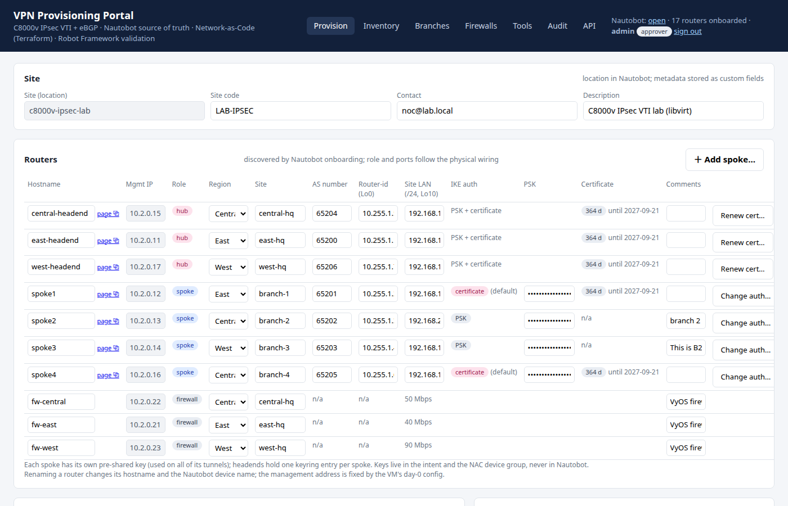

### Provision page
- **Site / Routers / VPN service / Crypto profile** — the whole intent is a form: site metadata, every
  router (hostname, region, branch site, AS, router-id, LAN, **its own pre-shared key** for spokes,
  comments), the VPN service (name, change ticket, owner) and its tunnels, the IKEv2/IPsec suite.
- **Internet breakout** (per region, nearest headend) and the **IKE authentication** default.
- **Deploy configuration**, **Dry run** (through `terraform plan`, nothing pushed), **Run tests only**. Runs execute one at a
  time; a second operator's run queues (cancellable until it starts).
- **Deployment status**: steps with results, live log, parsed test report with links to the Robot
  report, log, per-router config backups and the pre/post diff. Runs are kept and a failed or
  interrupted run can be **resumed from the failed step**. Every run also has **its own page** —
  see the Jobs tab below.

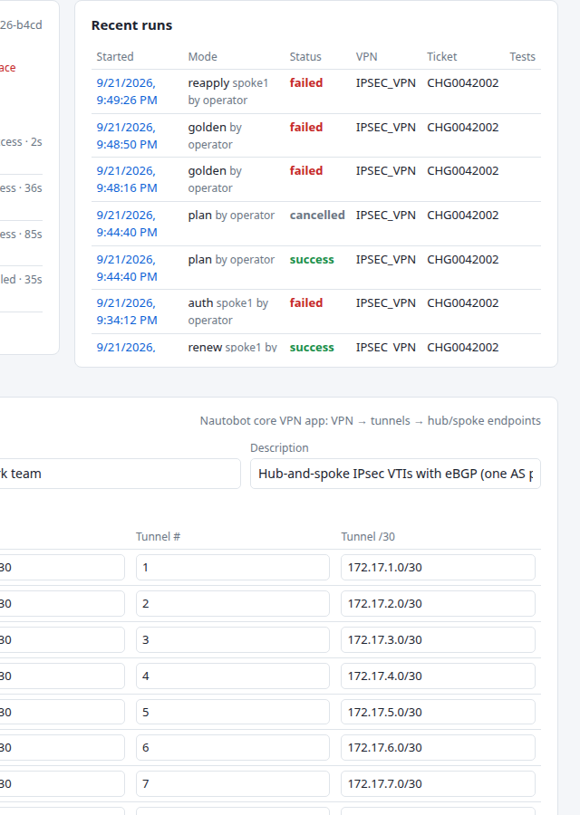

### Jobs tab — one page per job
Every change the portal makes is a **job**: a deployment or dry run, adding or removing a branch, a re-home, a key
rotation or certificate renewal, an authentication switch, Golden Config, a remediation, a re-apply or a test run.

- **The list** (`#jobs`) shows the recent jobs newest first with what each one does, its target, its status, a
  **progress bar with the step it is on**, how long it took (ticking while it runs), who started it, the change
  ticket and the test result — filterable by status, by kind of job and by a search over router, ticket or user, and
  it refreshes itself every five seconds.
- **A job's own page** (`#job/<id>`) is where a running job is watched: what the job does, KPIs (status, steps done,
  elapsed, who started it, tests passed), every step with its one-line summary and its duration, the **live log**
  with a *follow* toggle, and the test report with links to `report.pdf`, `report.html`, `log.html`, the per-router
  backups and the pre/post diff. A queued job shows its place in line and can be cancelled; a failed one can be
  resumed from its failed step, and the page is a plain link you can share.

Starting anything from anywhere in the portal — the Deploy button, a wizard, a day-2 action, a Compliance
remediation — opens that job's page, and every job id in the Branches, Compliance and Audit pages links to it.

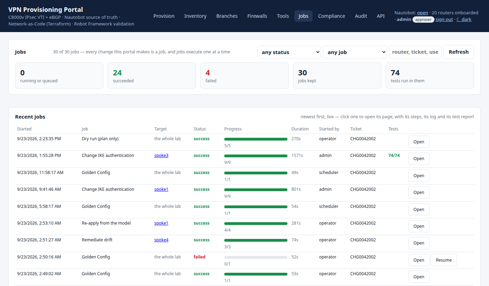
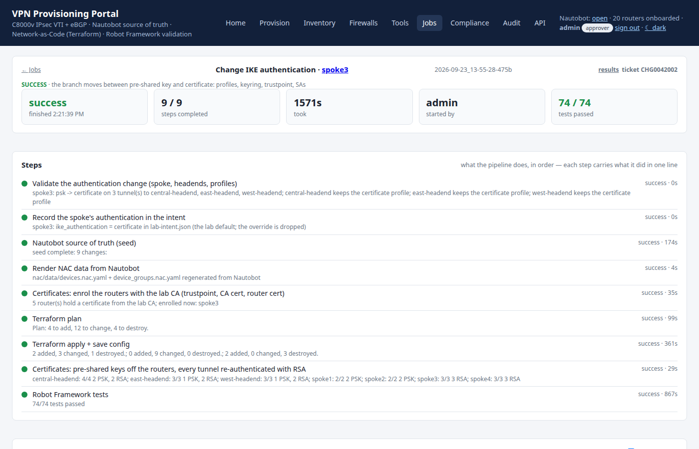

### How long a job takes — and why
Planning, not pushing, is what costs the time: a full `terraform plan` refreshes every resource of every router over
RESTCONF (about 100 s for this lab at `-parallelism=1`), and a day-2 job plans several times. Two things follow from that:

- **Plans read in parallel** (`-parallelism=8`, `NAC_PLAN_PARALLELISM`); applies stay serial, because writes to one router
  must not race. A full plan drops from ~100 s to ~50 s.
- **Day-2 jobs are scoped**. An authentication switch, a key rotation or a certificate renewal can only change one branch
  and the headends it is tunnelled to, so every plan and apply is targeted at those routers' resources
  (`tools/nac_apply.py --device …`, the same mechanism as *Re-apply from the model*), and the plan that discovers the
  changes compares the model with Terraform's state instead of re-reading every router. Golden Config, which runs at the
  end of the pipeline, is what notices a router that drifted behind Terraform's back.

Measured on this lab, one authentication switch (`spoke1`, PSK ↔ certificate, no tests): **699 s → 338 s**, of which the
plan step went 99 s → 9 s and the staged apply 361 s → 89 s. The Nautobot seed (169 s) is now the longest step of every job.

### Routers table — per-branch authentication and day-2 actions
Every router row shows its **IKE authentication** (each branch chooses pre-shared key or certificate; a headend shows the
methods its spokes use), the **certificate** it holds (days left), and the actions: **Change auth…**, **Renew cert…**,
**Rotate PSK…**, **Re-home…**, **Remove…** — plus a link to the router's own page.

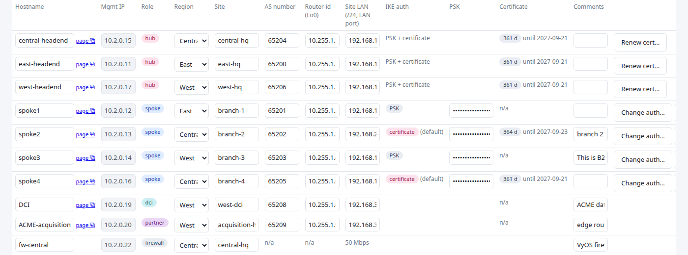
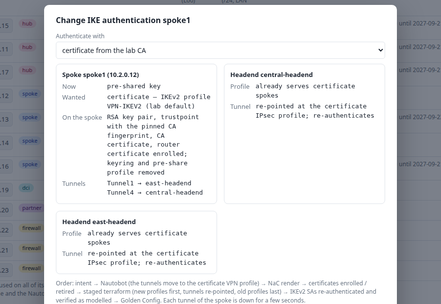

### Add a spoke — guided wizard
1. **Identity & metadata** — hostname, management IP, **region** (picks the nearest headends), branch
   site, site code, contact, generated PSK, change ticket; **Connect to headends** (at least two).
2. **Addressing, all auto-suggested** — per selected headend: hub port, spoke port, WAN /30, tunnel
   number, tunnel /30; plus router-id, LAN, AS. Everything is editable and re-validated.
3. **Review** — what the spoke gets and what **each headend** gets (WAN interface + address, TunnelN
   + destination, eBGP neighbour, Nautobot cable / tunnel / peering, capacity after).

*Provision spoke* creates and boots the VM, bootstraps it, onboards it into Nautobot, adds it to the
intent, then runs the pipeline — **headends and the new spoke are configured in one Terraform apply**.

| Step 1 | Step 2 | Step 3 |
|---|---|---|
| 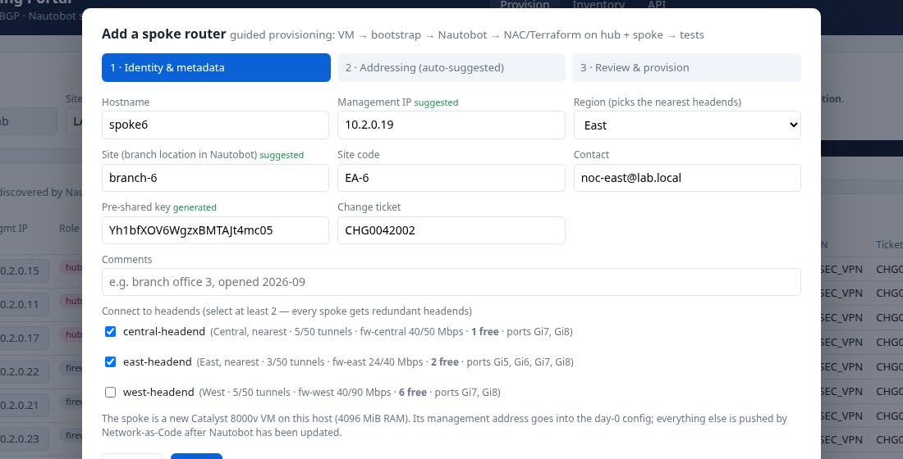 | 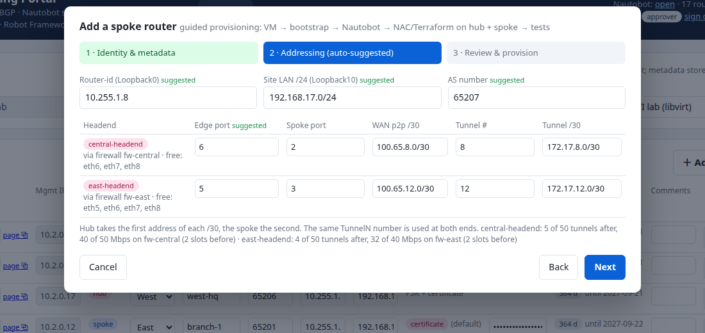 | 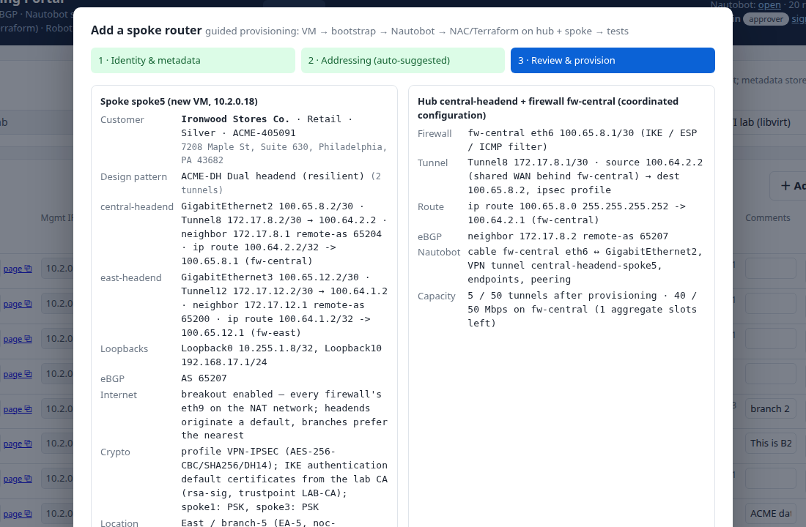 |

### Add a headend / remove a spoke
- A new headend (`POST /api/runs {"mode":"hub"}`) is linked to every existing spoke — the run
  re-defines the spokes for their new WAN port, brings the headend up, and applies both sides.
- **Remove…** on a spoke shows exactly what is released and what every headend loses, then powers
  off, cleans Nautobot, drops the router from the intent / `lab.conf` / Terraform state, destroys the
  headend-side tunnel and BGP neighbour, deletes the VM, and re-tests.

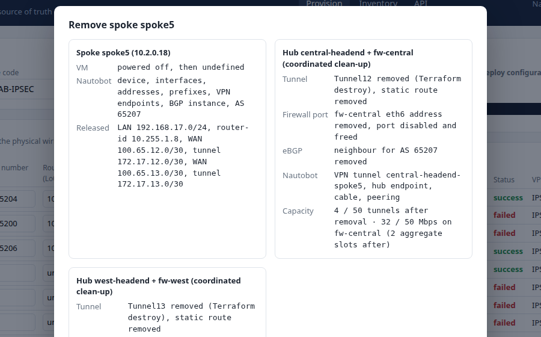

### Home page (the landing page)
Opening the portal lands here — the live picture of the service. (It is the inventory; `#home` and the older `#inventory`
both resolve to it.) KPIs, a **rendered topology** (headends on top, spokes grouped by region, one line per tunnel coloured
by live health, tooltips, links into Nautobot), **headend capacity** with two constraints per headend —
tunnels terminated (50, custom field `vpn_tunnel_capacity` on the hub) and the **bandwidth of the firewall
in front of it** (custom field `firewall_bandwidth_mbps`: fw-east 40, fw-central 50, fw-west 90 Mbps; every
tunnel commits `capacity.bandwidth_per_tunnel_mbps` = 8 Mbps) — plus the live **control-plane CPU** of each
headend (`show platform resources`, against the platform's warning threshold; data-plane QFP CPU and DRAM
alongside) — with an **aggregate** bar showing the tightest of the three and the effective free slots (the
model constraints set the slots, the wizard and deploy validation check them; a headend at its CPU threshold
has none), and a
per-tunnel report joining the Nautobot model with live IKEv2 / VTI / eBGP / ESP state collected from the
headends; **Export CSV** (tunnels plus a headend-capacity block).

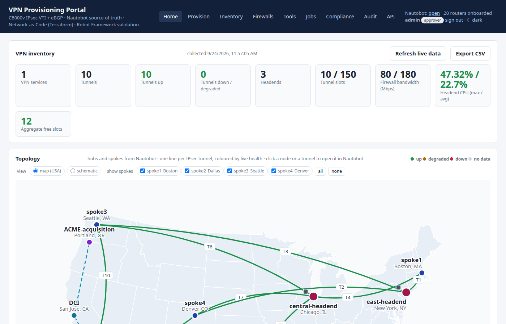
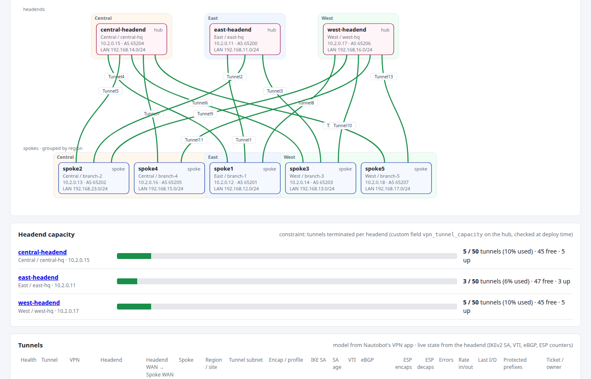

The topology is drawn on a map of the USA — headends in New York, Chicago and Los Angeles, branches in Boston,
Dallas, Seattle, Denver and Phoenix (Nautobot Location coordinates, from `lab-intent.json`) — with a spoke filter and a
schematic view as the alternative.
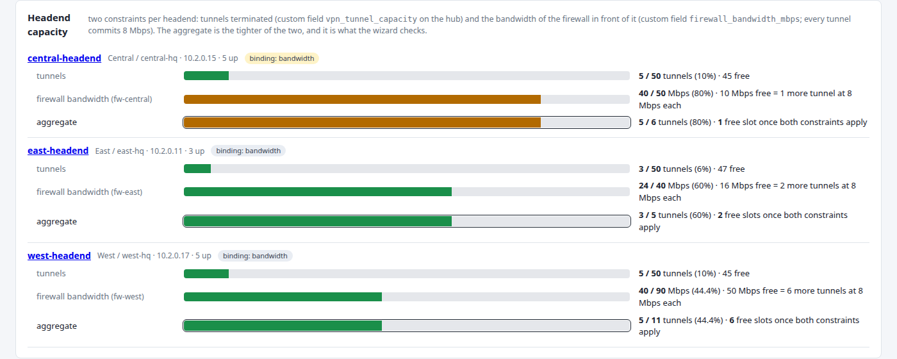
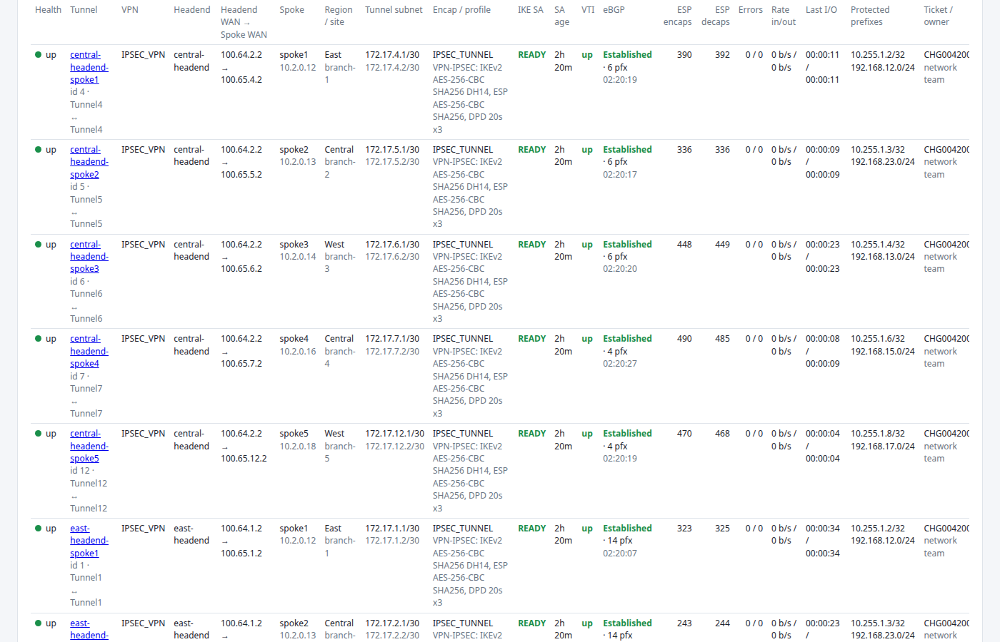

The **LAN hosts** card lists the Alpine VM behind every router; **Ping mesh** runs the full host-to-host matrix over the tunnels,
plus two more columns per host — its **own router** (the LAN gateway) and the **internet** (1.1.1.1 through its headend's breakout) —
every check green with its round-trip time, red when it fails; **▶ Live** keeps probing every check every 5 seconds with the
latencies updating in place (■ Stop ends it; the SSH sessions to the hosts stay open between probes).

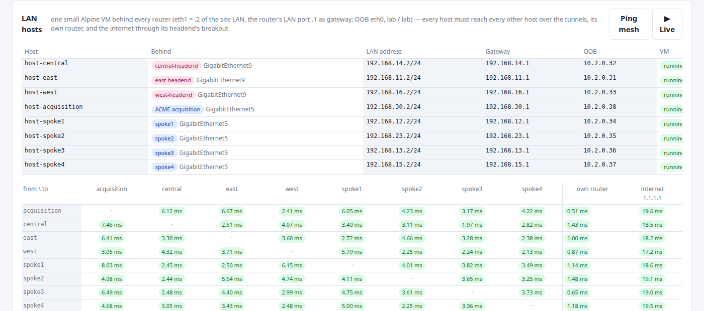

### Branches tab and the router page
Every branch is a **customer** of **ACME Networks**, the provider that sells the VPN service and owns the headends and their
firewalls. Each customer has a company name, street address, industry, ACME account, service tier (Bronze / Silver / Gold) and
contract start (generated deterministically for the lab, editable in the spoke wizard) and is a **Nautobot tenant** (group
*Customers*; ACME in *Service provider*) on the branch's router, LAN host and location; the address is the location's physical
address; the ACME custom fields carry account / tier / industry / contract on the tenant and the **ACME design pattern** on the
router and its location. The pattern is not chosen — it **follows from the number of tunnels** the branch has: `ACME-SH` single
headend (1), `ACME-DH` dual headend, resilient (2), `ACME-MH` multi headend, any-region (3+); headends show `ACME-HE`.

**Branches** lists every branch and headend — customer / owner, site and address, design pattern, tier, VM state, tunnels up,
IKE method, certificate days left, LAN host, free slots, last run — with a **filter bar**: free-text search (router, company,
city, address, account, site…) and selects for role, region, design pattern, service tier, industry, IKE authentication, tunnel
health and VM state (remembered per browser; the pattern legend below the table filters too). Each row opens the router's page,
which starts with the customer (or owner) box: company, address, industry, account, tier, contract, design pattern, and the
tenant in Nautobot; then identity, authentication and certificate, the internet breakout preference,
the day-2 actions, its tunnels with live IKE / VTI / eBGP / ESP state, the firewall rules and log lines touching it, its LAN
host, the runs that involved it, **live show commands**, and its **configuration** — the running config read over SSH, the
intended config and last backup from Nautobot's Golden Config with the compliance verdict per feature, a running-vs-intended
diff, the backup history from Gitea with per-commit diffs. The whole portal has a **dark / light** toggle in the header (it
follows the OS setting until chosen); the code panes have their own on top.

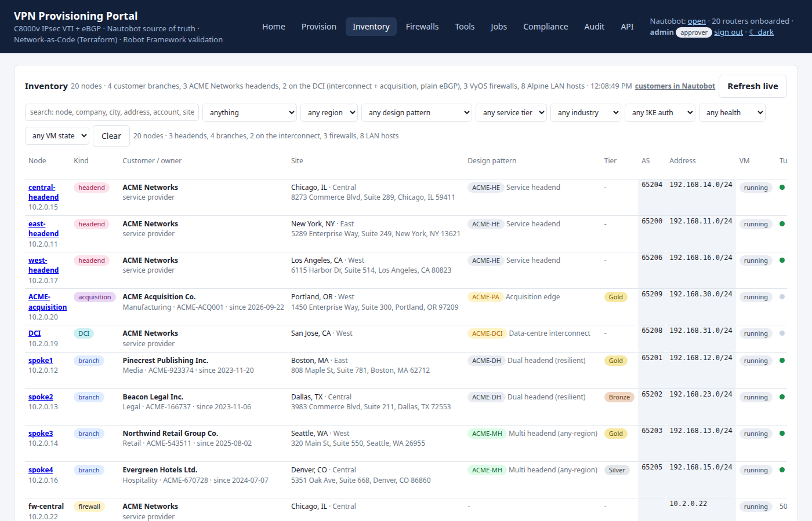
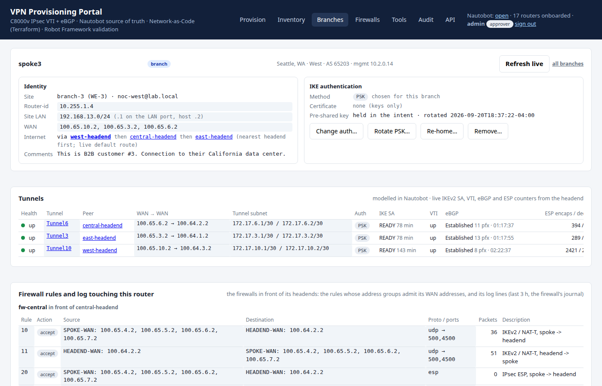
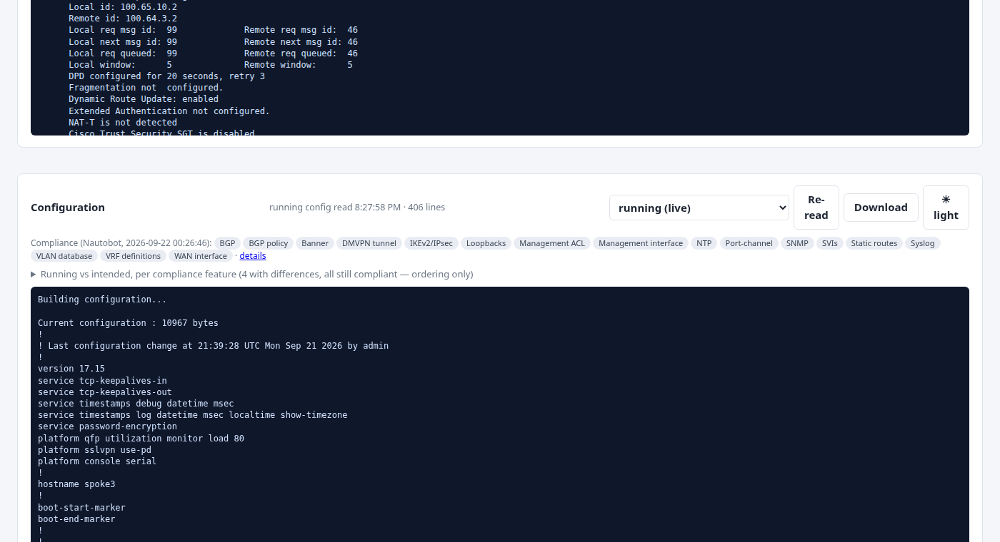

### Firewalls tab
Per VyOS firewall: interfaces, the live forward-filter rule set with counters (IKE / ESP admitted only between the modelled WAN
addresses, the internet breakout rule, everything else dropped and logged) and the firewall log — from the firewall's journal or,
for up to 30 days, from VictoriaLogs.

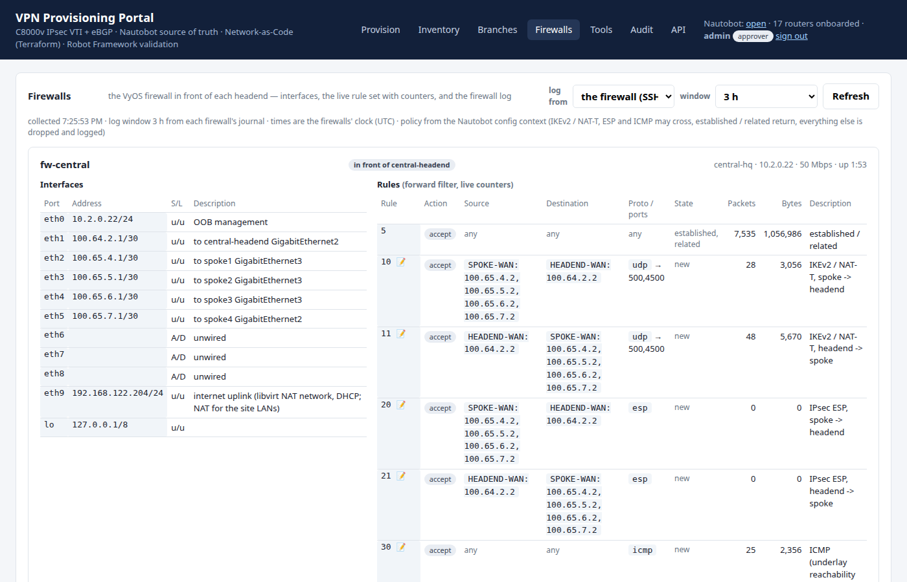

### Compliance tab
Nautobot Golden Config's verdict for every router: one row per router, one column per compliance feature (BGP, BGP policy,
banner, tunnels, IKEv2/IPsec incl. the trustpoint, loopbacks, management ACL / interface, NTP, SNMP, static routes, syslog, VRFs,
WAN interfaces…), green ✓ / red ✕ per cell; a cell shows the missing and extra lines and a running-vs-intended diff of that
feature. **Run Golden Config now** starts a `golden` run (backup → intended → compliance, nothing pushed) and refreshes the report.

Drift does not wait for an operator: the portal **schedules a Golden Config run every `GOLDEN_INTERVAL_HOURS`** (6 by default;
user `scheduler` in the run list and the audit trail, skipped while another run is going or the headends are off), records **one
drift-history line per compliance run** (which routers drifted and when it was fixed — the dots per router, the Drift history
table, `GET /api/compliance/history`, and the router's page), and exports the verdict to Prometheus
(`lab_config_compliance_ok{device}`, `lab_config_noncompliant_features`, `lab_config_compliance_last_run_timestamp_seconds`),
where the shared monitoring raises **`ConfigDrift`** (a router non-compliant for 10 min) and `ConfigComplianceStale` (no run for
twice the interval while the lab is up) and the IPsec dashboard shows a compliant/drifted timeline. A non-compliant cell offers
two fixes: **Remediate** pushes the remediation lines Nautobot computed for the feature (hier_config: `no …` for what is extra,
the missing lines themselves) over SSH and saves — the `remediate` run: validate → push → Golden Config; **Re-apply from the
model** re-asserts the model on that router alone — the `reapply` run: NaC render → Terraform plan and staged apply targeted at
the router's resources (`tools/nac_apply.py --device`) → Golden Config. Suite 10 does both for real: an extra static route and a
changed loopback description on a spoke, detected, remediated / re-applied, and the history and metrics checked.

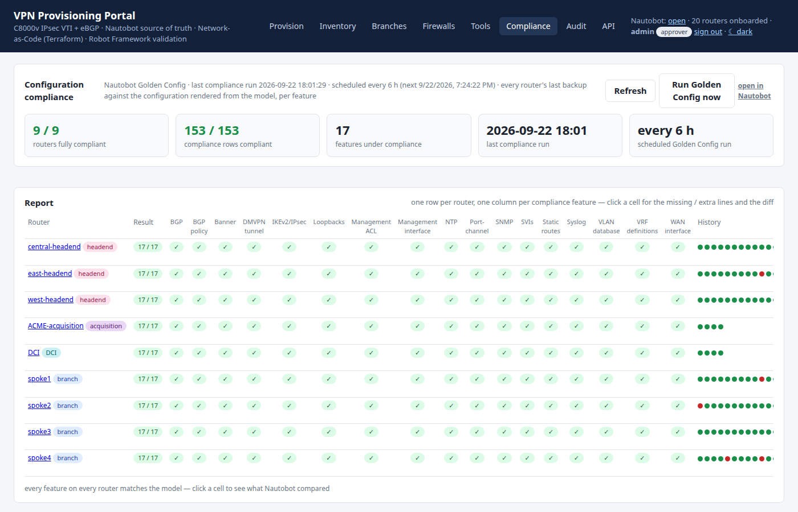

### Sign-in and audit
Local users or single sign-on (OpenID Connect; the lab's Gitea is the provider), three roles, and an audit trail of every login and
change request with the spec (secrets redacted) and the run it started.

| Sign-in | Audit trail |
|---|---|
| 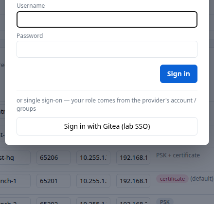 | 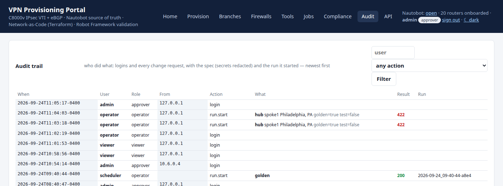 |

The portal has a **dark mode** (☾ / ☀ in the header; follows the OS setting until chosen):

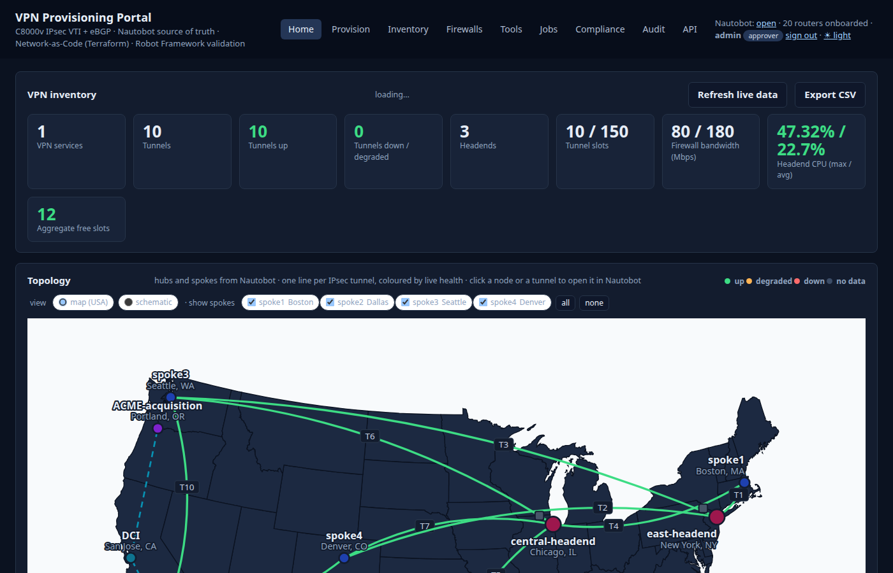

### REST API
Everything the UI does is an API call — typed and documented with Swagger at **`/docs`** (ReDoc at
`/redoc`): intent, inventory, spoke/headend suggestions and validation, removal / rotation / re-home / authentication / renewal
plans, the branch pages, hosts and the ping mesh, firewalls, PKI, runs (queue, resume, cancel), audit and SSO.

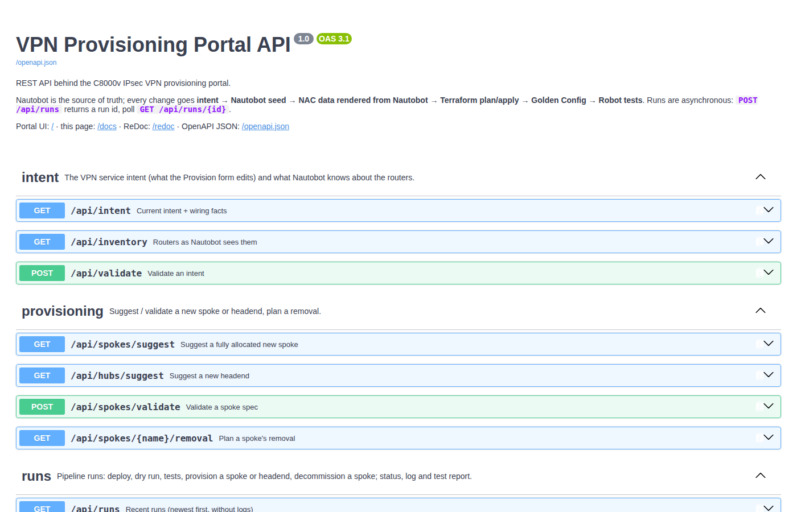

### Demos and documentation
- `webapp/demo/portal-demo.mp4` / `.gif` — a 3½-minute annotated tour of the portal: sign-in and roles, the intent form and the
  routers' day-2 actions, the spoke wizard with the customer block, runs and the queue, the inventory (topology, capacity, ping
  mesh live), Branches with the ACME customers / design patterns and filters, a router's page (live show, configuration, history),
  Firewalls, Compliance with Remediate / Re-apply, the drift history and a real Golden Config run, Tools, Audit, dark mode, the API
  (`webapp/demo/record.py` re-records it against the running lab; `--no-runs` starts nothing).
- `webapp/demo/nautobot-nac-demo.gif` — where the data lives in Nautobot and how NaC consumes it.
- **`docs/workflows.pdf`** — workflows, system-to-system data flows and decision trees, in detail
  (28 pages, 25 diagrams; source `docs/workflows.html`).
- **`docs/requirements.pdf`** / **`docs/requirements.xlsx`** — the requirements specification of the whole service: 106
  numbered requirements with priority, acceptance criteria and the suite / code that verifies each, as an 18-page PDF and as
  a filterable workbook (Overview with the count per area, Requirements, Roles & glossary, Traceability, Constraints).
  Both come from `docs/requirements.html`: `docs/build_pdf.py requirements.html` and `docs/build_xlsx.py`.
- **`docs/dci.pdf`** — the DCI in detail: the topology of the interconnect, the path a branch takes to the acquired
  company, the routes each side exchanges (and the ones deliberately filtered), the twice-NAT, the DNS fix-up, and how
  suite 12 proves all of it at 1000 prefixes and 1000 records — 20 pages with live command output, including an appendix with the configuration of the branch host, the DCI
  and the acquisition's DNS server, and a full topology diagram of the lab with its tunnel and router tables
  (source `docs/dci.html`).
- `webapp/README.md` — portal internals, run modes, resuming, platform quirks.

### Monitoring (Prometheus + Grafana on the NMS)
The portal's `/metrics` is scraped by the shared monitoring stack ([lab-portal/monitoring](https://github.com/dcantor/lab-portal)).
Besides the VM / run gauges it exports the **live tunnel inventory** while the headends run: per tunnel `lab_tunnel_health`
(2 up = IKEv2 READY + VTI up + eBGP Established, 1 degraded, 0 down), IKE SA age, prefixes from the spoke, ESP encaps /
decaps / error counters and VTI rates; per headend tunnels modelled / up, capacity and free slots after every constraint,
utilisation of the binding constraint (`lab_headend_binding{binding=tunnels|bandwidth|cpu}`), control-plane / QFP CPU,
DRAM, IKE sessions, bandwidth committed vs the firewall's. The **C8000v IPsec overview** dashboard
(http://192.168.50.231:3001/d/cat8000v-ipsec-overview) draws all of it; alerts `TunnelDown`, `HeadendUnreachable`,
`HeadendCapacityExhausted` and `HeadendCpuHigh` fire only while the hubs run. The dashboard's **Firewalls** row comes from
VictoriaLogs (the VyOS firewalls' remote syslog): dropped packets and new flows per 5 minutes per firewall, drops by source,
the top dropped flows and the raw kernel log; `FirewallDropBurst` (>20 drops from one source in 5 min) and
`FirewallDroppingPeerTraffic` (IKE / ESP hitting the drop rule) are evaluated by vmalert-logs from the same lines.

The **interconnect** has no tunnels, so it is watched by what it actually does (`webapp/interconnect.py`, collected in the
background and exported with the rest):

| Metric | What it says |
|---|---|
| `lab_nat_static_translations` / `_expected` | the static translations on the DCI against the number the model generates — 2002 here, so 2000 means a chunk of a CLI template did not make it onto the box |
| `lab_nat_active_translations`, `lab_nat_hits_total`, `lab_nat_misses_total` | the NAT table and how much it is used |
| `lab_nat_drops_total{direction}` | packets dropped for want of a translation, per direction |
| `lab_nat_aggregate_route{kind,prefix,source}` | 1 while the aggregate the two sides exchange instead of their overlapping prefixes is in the routing table |
| `lab_dns_zone_records` / `_expected`, `lab_dns_server_up` | each zone's records against the model, and whether the router still answers for it |
| `lab_dns_fixup_ok`, `lab_dns_fixup_timestamp_seconds` | the verdict of the packet capture suite 12 takes on both sides of the DCI, and when |

The dashboard's **Data-centre interconnect** row draws them, and the alerts are `NatTranslationsMissing`, `NatDrops`,
`NatAggregateRouteMissing`, `DnsZoneShrunk`, `DnsServerDown`, `DnsFixupFailing` and `InterconnectUnreachable` — all gated on
the DCI VM running, so a powered-off lab is quiet.

Both live collectors (the tunnel inventory and the interconnect) and Nautobot's compliance verdict are kept warm by
background threads: collecting them takes 10–15 s each, which is longer than Prometheus waits, and doing it inside the
scrape had the portal's own `up` sitting at 0.64. A scrape is now a cache read (~0.4 s).

### Sign-in, roles, audit
The portal asks for a login (local users, lab defaults admin/admin · operator/operator · viewer/viewer — or **single sign-on**
through OpenID Connect, the lab's Gitea acting as the provider; `webapp/oidc.json` maps accounts and groups to roles): **viewer**
reads, **operator** provisions and changes, **approver** also removes spokes and manages users. Every login and every change
request — who, from where, the spec with secrets redacted, the run it started — lands in an append-only audit trail (Audit tab,
`GET /api/audit`); runs record who started them. `python3 webapp/auth.py add NAME --role …` manages local users. Runs execute
one at a time: a second operator's run **queues** behind the executing one (place in line shown; cancellable until it starts).
Every router has its own page (the **Branches** tab, or `#branch/<name>`): tunnels with live state, authentication and certificate, the firewall rules
and log touching it, its LAN host, the runs that involved it, its running / intended configuration with the compliance
verdict, and the day-2 actions.

### Day-2: re-home a branch
**Re-home…** on a spoke row moves a branch onto a different set of headends (at least two): headends to add get a link, a
tunnel and an eBGP session allocated and built (the spoke VM is redefined and rebooted for the new NIC), headends to drop have
theirs destroyed and cleaned out of Nautobot; the run verifies the new tunnels up and the dropped ones gone. Proven both ways.

### Day-2: rotate a spoke's pre-shared key
**Rotate PSK…** on a spoke row runs the whole chain: new key → intent → Nautobot (fingerprint + date on the tunnels, never the
key) → NaC → terraform on the spoke and every headend → the spoke's IKEv2 SAs cleared → every tunnel verified READY with eBGP
Established → Golden Config. About four minutes; the tunnels blip for seconds.

### Pre-shared key or certificate — each branch decides
Every spoke chooses how it authenticates IKEv2: **its own pre-shared key** or **a certificate from the lab CA** — picked in the
spoke wizard (*IKE authentication*; `ike_authentication` on the device in the intent) and changeable later with **Change auth…**
on its row (`mode: auth`). `profile.ike.authentication` is only the default for spokes that do not choose. The model follows the
choice: Nautobot holds **one VPN profile per method in use** (the default keeps the intent's names, the other one is suffixed
`-PSK` / `-CERT`), every tunnel references its spoke's profile, and a headend renders **one IKEv2 / IPsec profile per method its
spokes use** — the PSK profile matching exactly its PSK peers' WAN addresses with a keyring of just those spokes, the certificate
profile matching on the certificate map — so a headend serves both kinds of branch at once. A router holds a certificate only
while one of its tunnels needs it; a spoke that moves to its key gives its trustpoint back (`pki.py` retires it, the CA index
keeps the serial under `retired`, Nautobot's `cert_*` fields clear). Terraform changes of this kind are applied in stages
(`tools/nac_apply.py`: creates, then in-place updates, then the destroys) because the NaC module has no edge between a tunnel and
the profile it references. Certificates themselves work like this — `pki/ca.py` (openssl on the host: `pki/ca/ca.crt` public and
committed, `ca.key` never committed, `pki/certs/*.crt` and `pki/index.json` the record of what was issued). The `pki`
pipeline step (`nautobot/pki.py`, `./lab.sh nautobot pki`) enrols every router over SSH the way a real PKI would: an RSA
key pair generated **on the router** (the private key never leaves it), a trustpoint with `enrollment terminal pem` and the
**CA fingerprint pinned**, `crypto pki authenticate` with the CA certificate, `crypto pki enroll` → CSR → signed by the CA
→ `crypto pki import … certificate`. Nautobot holds the model: the Phase 1 policy's authentication method (`RSA`), the
trustpoint / key-pair / certificate-map names and the CA fingerprint in the profile's Cisco names, and per device the
custom fields `cert_serial`, `cert_subject`, `cert_expires`, `cert_renewed` written after each enrolment. The NaC render
drops the keyrings and the pre-share lines; the rsa-sig profile lines the Terraform provider cannot express (`match
certificate`, `identity local dn`, `authentication local/remote rsa-sig`, `pki trustpoint`) ride as one `iosxe_cli` template
per router; the `pki_verify` step after the apply removes the keyrings (IOS refuses the provider's delete while the profile
still references them), clears SAs still on a key and verifies every tunnel back READY with `Auth sign: RSA, Auth verify:
RSA`. The Golden Config template renders the trustpoint and the certificate map, and the crypto compliance rule covers them.

Day-2: **Change auth…** on a spoke row (`mode: auth`: intent → Nautobot → render → certificates enrolled or retired → staged
terraform on the spoke and its headends → every SA re-authenticated and verified as modelled → Golden Config; ≈5 min) and
**Renew cert…** on any router row holding a certificate (`mode: renew`) — a new CSR, signed, imported, Nautobot updated,
the router's SAs cleared, every tunnel verified back with RSA (≈1 min). The `pki` step also renews on its own within
`renew_before_days` (30) of expiry on every deploy. `/metrics` exports `lab_cert_not_after_seconds` per router and
`lab_ike_certificate_auth`; the shared monitoring alerts `CertificateExpiringSoon` / `CertificateExpired`. Switching back
to `psk` re-renders the keyrings from the keys still held in the intent. Suite 08 proves all of it, including a real renewal
through the portal.

## Nautobot: the source of truth

Nothing about the topology is hard-coded in templates: the renderer and the Golden Config template
read everything from Nautobot objects (details in [nautobot/README.md](nautobot/README.md)).

| What | Where in Nautobot |
|---|---|
| Customers | **tenants**: ACME Networks (group *Service provider*: headends, firewalls, HQ sites) and one tenant per customer company (group *Customers*: the branch's router, LAN host and location) with the ACME custom fields `acme_account_id`, `acme_service_tier`, `acme_industry`, `acme_contract_start`; the branch location's `physical_address`; `acme_design_pattern` (select: single / dual / multi headend — from the tunnel count) and `acme_pattern_tunnels` on routers and locations |
| Sites | location hierarchy **lab site → Region (East/Central/West) → Branch** (`east-hq`, `branch-1`…) with `site_code` / `contact` custom fields; regions are ordered so the wizard can pick the nearest headends |
| Routers | devices discovered by the Device Onboarding app (model, serial, platform, mgmt IP); roles `vpn-hub` / `vpn-spoke` / `vpn-firewall`; `vpn_tunnel_capacity` custom field on headends, `firewall_bandwidth_mbps` on firewalls |
| Physical | interfaces (spoke-facing ports, loopbacks, `TunnelN` of type *tunnel*), **cables** for the p2p WAN links, prefixes with roles (`wan-p2p`, `vpn-tunnel`, `site-lan`, `loopback`), `bgp:advertise` tags |
| VPN | the **core VPN app**: Phase 1 / Phase 2 policies → profile `VPN-IPSEC` → VPN `IPSEC_VPN` → one **VPN Tunnel per (headend, spoke)** with hub/spoke **endpoints** (source interface + address, tunnel interface, protected prefixes); Cisco object names in the profile's `extra_options` |
| Routing | nautobot-bgp-models: one AS per site, a routing instance per router, an eBGP peering per tunnel |
| Config | config context (OOB VRF/gateway/ACL, domain), the saved GraphQL query `nac-c8000v-ipsec-model`, Golden Config setting + Jinja template + compliance (136/136) |
| Not in Nautobot | pre-shared keys (one per spoke, in `lab-intent.json` → NAC variables) and device credentials (secrets group from NMS environment variables) |

| Devices at the lab location | Location hierarchy |
|---|---|
| 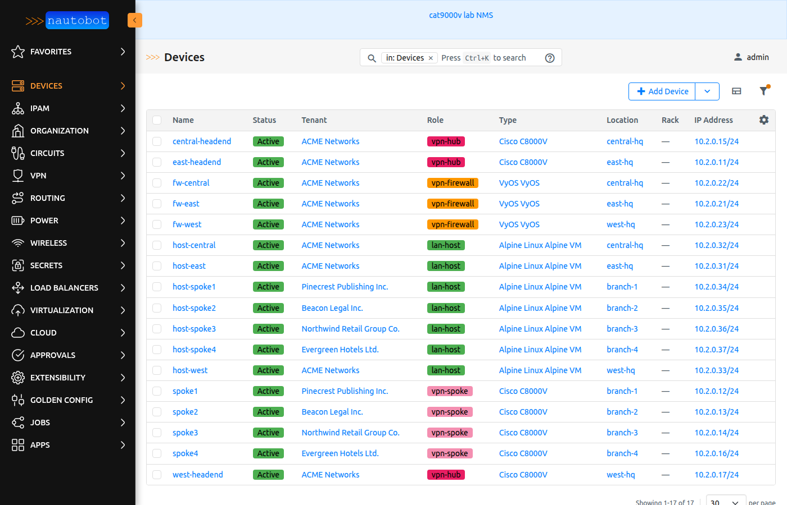 | 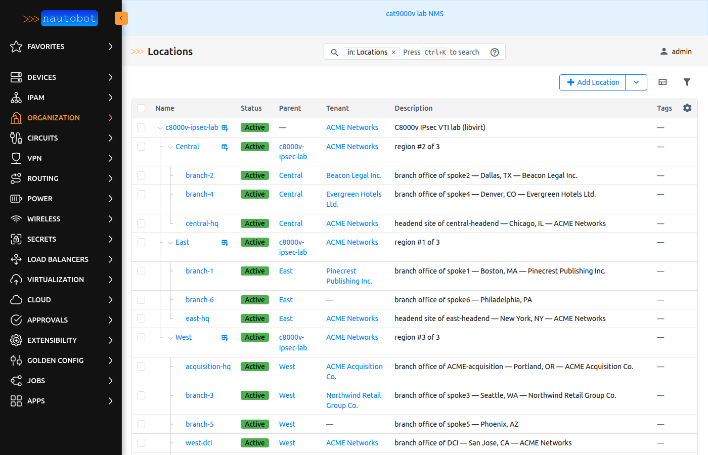 |

| Customers (tenants) with the ACME fields | A branch device: tenant, address on its location, design pattern |
|---|---|
| 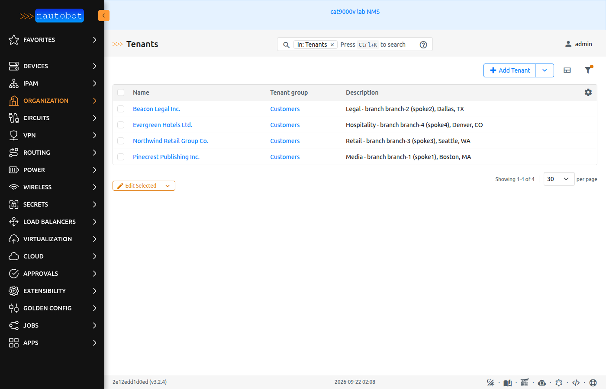 | 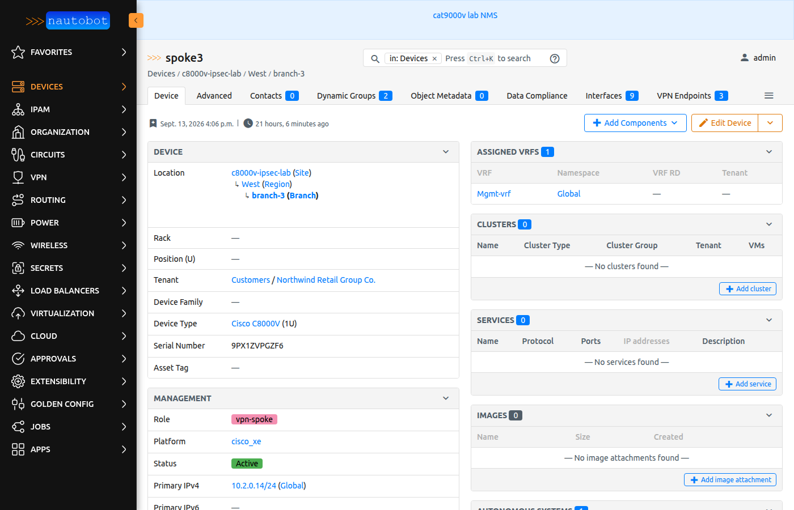 |

| The VPN service | Its tunnels |
|---|---|
| 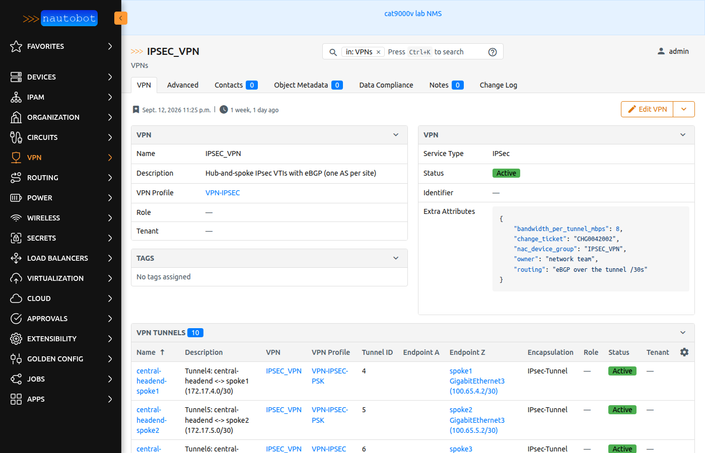 | 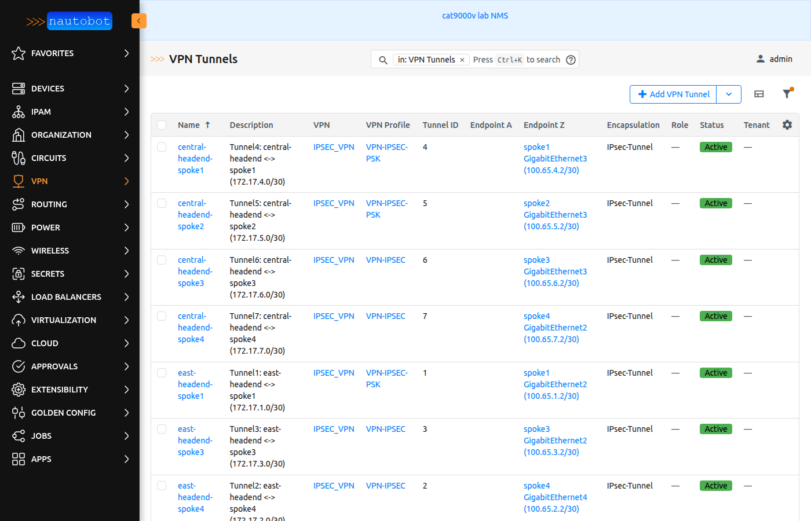 |

| A tunnel with its endpoints | The crypto profile (Phase 1 / Phase 2) |
|---|---|
| 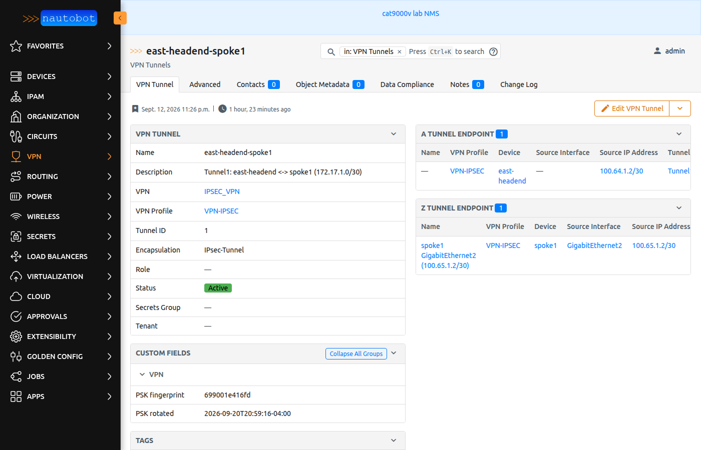 | 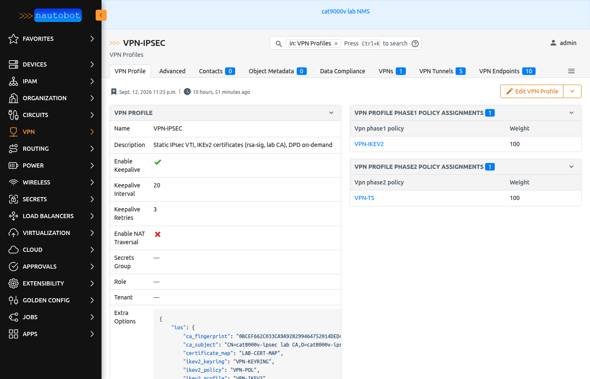 |

| eBGP peerings | Golden Config compliance |
|---|---|
| 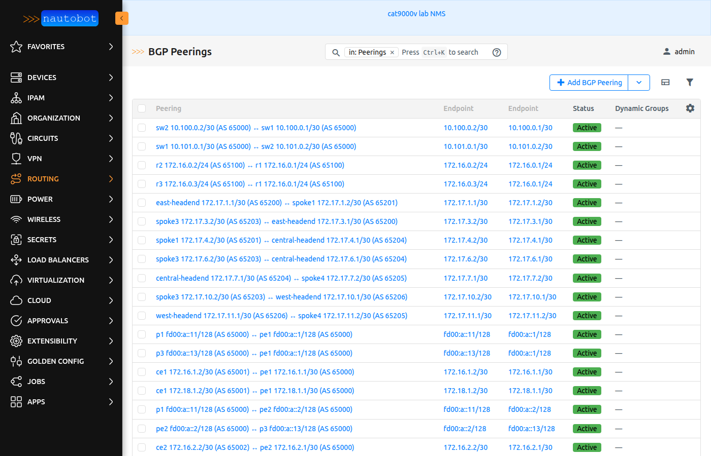 | 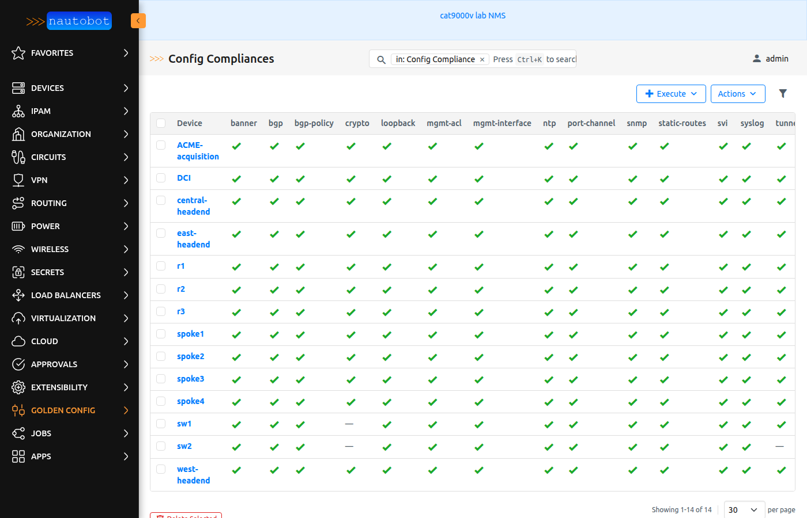 |

## The DCI: an acquired company inside the VPN

`DCI` and `ACME-acquisition` are two more Catalyst 8000v routers, but they are **not branches**: they carry no IPsec. ACME's
**data-centre interconnect** hangs off west-headend's Gi3 on a plain /30 (`100.64.20.0/30`), and the **acquired company's edge
router** hangs off the DCI on another (`100.64.21.0/30`); each hop is an eBGP session (65206 ↔ 65208 ↔ 65209) built from the same
nautobot-bgp-models peerings the tunnels use — only the transport differs. The acquisition originates two prefixes, its site LAN
`192.168.30.0/24` (with an Alpine host behind it, in the ping mesh) and a service prefix `10.60.0.0/24` on `Loopback1`; west-headend
re-advertises them over the tunnels, so **every branch reaches them** and the acquisition reaches every branch and the internet
(through west-headend's firewall, which NATs every site LAN of the VPN).

Everything is modelled the same way: device roles `vpn-dci` / `partner-edge`, ACME's tenant on the DCI and a **customer tenant of
its own** for the acquisition (design patterns `ACME-DCI` / `ACME-PA`), the links as cables with their prefixes, the extra loopback
as a prefix tagged `bgp:advertise`. The NaC renderer emits their configuration with no crypto block, and the Golden Config template
renders them from the same file — both are **17/17 compliant** like every other router. Suite 12 proves the chain end to end.

The portal draws the chain in both topology views — on the map at its cities (San Jose, Portland) and in the schematic as its own
row — with **dashed links** and the AS pair, so it reads differently from an IPsec tunnel at a glance:

### Overlapping address space: twice-NAT and DNS fix-up on the DCI

An acquired company brings its own addressing, and some of it collides with ACME's. The lab models that: `ACME-acquisition` runs a
server on **192.168.12.2/24** — the same prefix *and* the same address as ACME's branch-1 LAN and the host behind spoke1. The
overlapping prefix lives in its own **Nautobot namespace** (`acquisition`), because it is not ACME's address space.

The DCI hides the collision with a **twice-NAT** (`ip nat inside` towards the acquisition, `ip nat outside` towards ACME):

| Seen from | Address | Translated on the DCI to |
|---|---|---|
| ACME | the acquisition's server | `172.31.12.2` (inside global) → `192.168.12.2` |
| the acquisition | ACME's host-spoke1 | `172.30.12.2` (outside local) → `192.168.12.2` |

Neither side ever learns the other's copy: a prefix-list `OVERLAP` and route-map `NO-OVERLAP` filter it **in and out** on the ACME
session and out on the acquisition's, and the DCI advertises the two translated /24s instead (a `Null0` route for the inside-global
range, which NAT translates before the routing lookup, and a route towards ACME for the outside-local one, which it translates
after). So every router keeps exactly one path per prefix and both directions work end to end — branch host to acquisition server
and back.

**DNS fix-up** completes the illusion: west-headend answers for `acme.local` (`ip dns server`, one `ip host` record per ACME host),
and the acquisition resolves through the DCI sourced from its overlapping address. `ping host-spoke1.acme.local` on
`ACME-acquisition` comes back as **172.30.12.2**, not the 192.168.12.2 in the record — the NAT rewrote the answer on its way
through. Both the NaC renderer and the Golden Config template render all of this from one config context keyed by hostname, and two
new compliance features (**NAT (DCI)**, **DNS**) keep it honest: 171/171 rows compliant.

**At scale.** A `scale` block in the same NAT intent puts **1000 overlapping /24s** on both sides at once
(`10.128.0.0/24` … `10.131.231.0/24`; ACME holds `.1` in each, the acquisition `.2`), each with its own pair of static
translations — **2002 static entries** on the DCI — while BGP only carries three aggregates (`100.96.0.0/14`,
`100.100.0.0/14`, `10.128.0.0/14`) and the filter one extra prefix-list line: the scale lands on the NAT, not on the routing
table. A thousand interfaces would be absurd, so each side carries its thousand addresses as **secondaries on one loopback**
(`Loopback900`), and because IOS-XE's CLI RPC rejects a payload of that size the renderer splits every template into chunks of
400 lines. A branch host reaches all 1000 translated prefixes (**1000/1000 in about five seconds**, forty pings in parallel), the
acquisition reaches ACME's copies the same way, and the DCI reports no drops and no allocation failures.

**DNS in both directions.** Each side answers for its own zone with its own copies: west-headend serves `acme.local`
(`svc0…svc999` → `10.128.x.1`) and **ACME-acquisition serves `acquisition.local`** (`acq0…acq999` → `10.128.x.2`) — about
1000 `ip host` records each. A branch host, `host-spoke1`, has the acquisition's server as its resolver — at the address ACME
sees it on, `100.96.0.2` — so its queries *and* the answers cross the NAT:

```
host-spoke1 # nslookup acq7.acquisition.local     ->  100.96.7.2      (the record says 10.128.7.2)
DCI # show ip nat translations | include :53
udp  100.96.0.2:53   10.128.0.2:53   172.30.12.2:50370   192.168.12.2:50370
```

The suite resolves every one of the thousand names from the branch host and pings what came back: **resolved+reached 1000/1000**.

**Proof on the wire.** `tools/dns_capture.py` puts an IOS-XE Embedded Packet Capture on **both** of the DCI's interfaces at
once, resolves a name from a branch host, pulls the two buffers off the router as **.pcap files** and decodes them: the same
transaction, the same question, the server's real address (`10.129.244.2`) on the inside and its translated form
(`100.97.244.2`) on the ACME side — the A record rewritten in flight, with its TTL zeroed. The two captures are committed under
`docs/captures/` and explained in `docs/dci.pdf`; suite 12 repeats the capture on every run and keeps the pcaps next to the
run's results.

Both halves of the flow are translated and the A records are rewritten in flight, so the host can reach what it just resolved.
The host's resolver comes from the intent too (`dns_client` on the host; cloud-init writes it, and the instance-id now follows a
hash of the seed so a changed resolver is actually applied on the next boot).

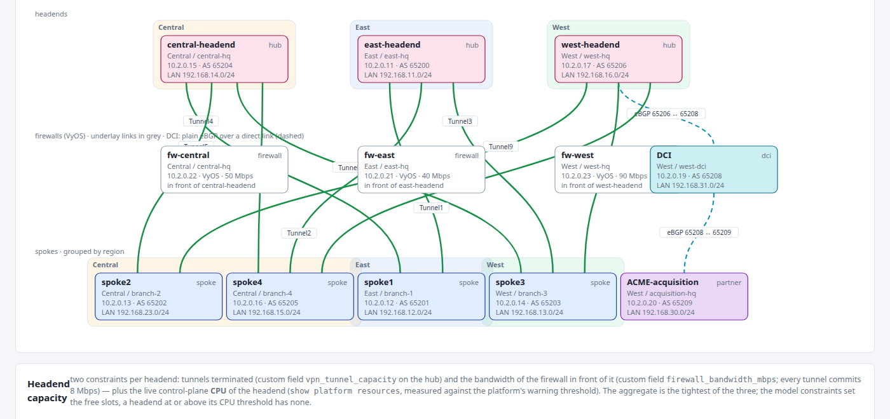


## Network-as-Code

- `nac/data/global.nac.yaml` — the hand-written baseline (AAA, SSH/VTY hardening, management ACL, banner).
- `nac/data/devices.nac.yaml` — **generated from Nautobot** by `nautobot/render_nac.py`: WAN
  interfaces (unused ports explicitly shut), loopbacks, **native VTI tunnel interfaces**, the crypto
  suite with **per-spoke keyring peers**, the full eBGP block per router.
- `nac/data/device_groups.nac.yaml` — generated: the `psk_<spoke>` variables (the only secret).
- Module `netascode/nac-iosxe` 0.1.0, provider `CiscoDevNet/iosxe` 0.15 over RESTCONF, `-parallelism=1`,
  `cisco-ia:save-config` after apply; crypto profiles are applied first on a new router and the apply
  step re-asserts once after an IOS-XE datastore re-sync (see `webapp/README.md`).

## Connecting to the SRv6 core (optional, currently detached)
Each headend's `GigabitEthernet3` can be cabled (a UDP link, like every other link here) to a PE of the
[srv6-core](https://github.com/dcantor/srv6-core) lab and runs eBGP to it inside that core's VRF *tenant-a*
(`172.19.n.0/30`, headend `.1`, PE `.2`, PE AS 65000). The headend announces its site LAN and the branch LANs it learns
over the tunnels; the core hands back the data-centre LANs, so every branch reaches every data-centre host through IPsec
→ headend → SRv6 → PE → CE → host. The attachment is **declared in the SRv6 lab** (`EXT_NODES` / `LINKS` in its
`lab.conf`) and **modelled on the headend by that lab's Nautobot seed** (Gi3 address, cable, BGP peering); this lab's
pipeline then renders and pushes it like anything else — `render_nac.py` turns the enabled, cabled Gi3 and the peering
into NaC data, `./lab.sh nac apply` configures the router, Golden Config stays compliant. Detaching is the reverse: the
SRv6 seed hands Gi3 back as unwired, and the next `render` / `nac apply` here removes the interface address and neighbour
(the routers are currently off, so that apply is pending for the next bring-up). The seed here treats a port
cabled to a device outside this lab as *foreign-wired* and never touches it. Test `04_routing` allows exactly one such
core session per headend; the end-to-end proof lives in the SRv6 lab's suite `12_interconnect`.

## Tests

`./lab.sh test` (or the portal) runs 75 Robot tests: management plane; underlay links and CDP; VTIs,
IKEv2 SAs (with the modelled authentication) and real encryption; eBGP sessions, prefixes and spoke↔spoke paths via a headend; **no
Terraform drift**; the firewalls (modelled, in sync with Nautobot, actually filtering, their log in VictoriaLogs); the Nautobot model — devices and serials, cables, VPN objects (every router's
tunnel destination equals the far endpoint's source address), the location hierarchy, **per-spoke
keys on every router**, BGP model vs live sessions, rendered NAC data == committed, Golden Config
compliant; and suite 08 — the CA pinned on every router with a certificate tunnel, each certificate issued by it to the router's
own name and not near expiry, rsa-sig on those tunnels and keys only where a spoke chose one, Nautobot's record of it, a real
renewal and a real PSK ↔ certificate switch of a spoke through the portal; and suite 09 — the LAN hosts, their Nautobot model, the full host-to-host ping mesh and the path over the tunnels; suite 10 — the portal itself (run queue and cancel, every
router's page, the compliance report and its scheduled run, drift detected → remediated with Nautobot's lines and re-applied from the model, the single sign-on flow);
suite 12 — the DCI chain (model, links, eBGP per hop, the acquisition's prefixes routable from every branch, its host in the mesh and on the internet, the overlapping prefix translated in both directions and DNS fixed up — a thousand prefixes and a thousand records at once, and the fix-up captured on both sides of the DCI — Golden Config compliant); and suite 11 — the internet breakout (NAT, return routes, default origination, nearest-headend
preference, every host on the internet through its region's headend).
A suite **waits for the portal's run queue** before it starts (`tests/queue_state.py`): jobs execute one at a time, so a
suite started while a deployment is mid-flight would fail every test that needs the queue. It waits up to `QUEUE_WAIT`
seconds (default 1800, `QUEUE_WAIT=0` to skip the check) and names the job it is waiting for; the portal's own test step
is exempt. The scheduled Golden Config run skips its cycle for the same reason.

Each run keeps pre/post config backups and a diff under `results/`, plus **`report.pdf`** — a one-file evidence report built
from `output.xml` (`tests/report_pdf.py`): every suite and test with its result, its duration and the numbers it measured
(the NAT and DNS sweeps, the compliance rows, the IKEv2 SAs), so a run can be read without opening `log.html`.

## What is where

| Path | Purpose |
|---|---|
| `lab.conf`, `lab.sh`, `tools/`, `nodes/` | VM facts and libvirt controller (`up down bootstrap rebuild clean rename status console ssh hosts nac nautobot test intent webapp`), console automation, day-0 template, `tools/nac_apply.py` (staged terraform apply: creates, updates, then destroys) |
| `lab-intent.json`, `nautobot/intent.py` | the VPN service intent (site, regions, devices + PSKs, links, tunnels, crypto, capacity); generated from `lab.conf` once, edited by the portal |
| `nautobot/` | onboarding, seed (intent → Nautobot, idempotent), renderer, Golden Config, certificate enrolment (`pki.py`), rename tool, saved GraphQL query, Jinja template |
| `pki/` | the lab CA (`ca.py`; `ca/ca.crt` public, `ca/ca.key` never committed), issued router certificates and the index |
| `nac/` | Terraform root and NAC data |
| `tests/` | Robot suites 01–11, keyword library, `lab_vars.py` derived from the intent |
| `webapp/` | the portal (FastAPI + single-page UI), API schemas, spoke/headend provisioning, inventory collector, run records, demo recorders, `lab-webapp.service`, `restart.sh` |
| `docs/` | the workflows/decision-tree PDF and its source, screenshots |
| `results/` | one folder per test run |

The portal's run engine (steps, streamed log, resume, Robot reports) is the shared
[lab-portal](https://github.com/dcantor/lab-portal) package, which also serves the **lab hub** at
http://192.168.50.231:8088 — every lab on the host with its VMs, portal health, last tests and links.

## Running the portal as a service

`webapp/lab-webapp.service` is a systemd *user* unit (`systemctl --user enable --now lab-webapp`,
lingering enabled so it starts at boot). Restart with `webapp/restart.sh` — it refuses while a run is in
progress, because a restart interrupts the run (interrupted runs are marked and can be resumed).

## Design notes and quirks worth knowing

- **Links are anchored on the headend**: each headend has 8 spoke-facing ports and a link's UDP socket
  pair is derived from the headend side, so adding a spoke never touches a headend VM; adding a headend
  re-defines and reboots the spokes once (their new port). Spokes have 4 WAN ports (`SPOKE_PORTS`).
- **Serials follow the VM UUID** on a C8000v: domains get a deterministic UUID derived from the
  management IP, and onboarding refreshes serials over SSH anyway.
- **IOS-XE re-syncs its YANG datastore** after interface deletions or reloads and then elides default
  values — the NAC baseline avoids default-valued attributes and the pipeline converges with one extra
  apply when needed.
- **Nautobot 3.2.4 REST quirks** worked around in the seed: profile↔policy assignments 500 (done via
  `nbshell`), M2M fields absent from reads (verified via GraphQL, PATCHed directly), endpoint tunnel
  interfaces must be of type `tunnel`, deleting a device leaves a half-terminated cable.
- **Host sizing**: Ryzen 5 5600G (6c/12t), 57 GiB; eight C8000v (2 vCPU / 4 GiB) plus the NMS is
  the practical ceiling — first boots then exceed 15 minutes (bootstrap waits up to 30).
